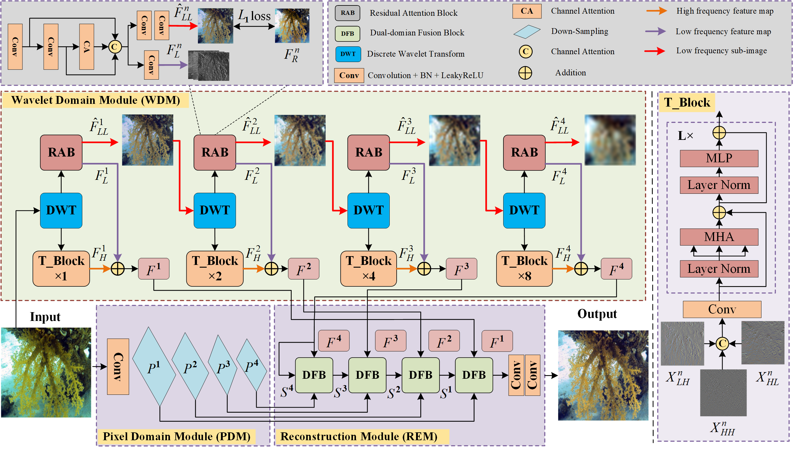

## Wavelet-pixel domain progressive fusion network for underwater image enhancement (WPFNet)

<div align="center"> 

🎯Our paper has been accepted by [Knowledge-Based Systems 2024](https://www.sciencedirect.com/science/article/abs/pii/S095070512400683X)  
</div>

### Introduction
```
Our work proposes a “Wavelet-pixel domain progressive fusion network for underwater image enhancement” (WPFNet). The proposed WPFNet progressively merge frequency features capturing fine-grained details and spatial features with rich color and illumination information.
```


## Getting Started

### Requirements

- Python 3.8
- Pytorch 1.7.0

### Prepare Datasets

```
data
├── UIEB
│   └──trainA
│   └──trainB
├── Underwater-Dark
│   └──trainA
│   └──trainB
```

### Training

```
python Underwater_train.py --data_dir=./your dataset path
```

## Citation
```
@article{liu2024wavelet,
  title={Wavelet--pixel domain progressive fusion network for underwater image enhancement},
  author={Liu, Shiben and Fan, Huijie and Wang, Qiang and Han, Zhi and Guan, Yu and Tang, Yandong},
  journal={Knowledge-Based Systems},
  volume={299},
  pages={112049},
  year={2024},
  publisher={Elsevier}
}
```

## Contact
If you have any questions, please contact Shiben Liu at [liushiben@sia.cn].
